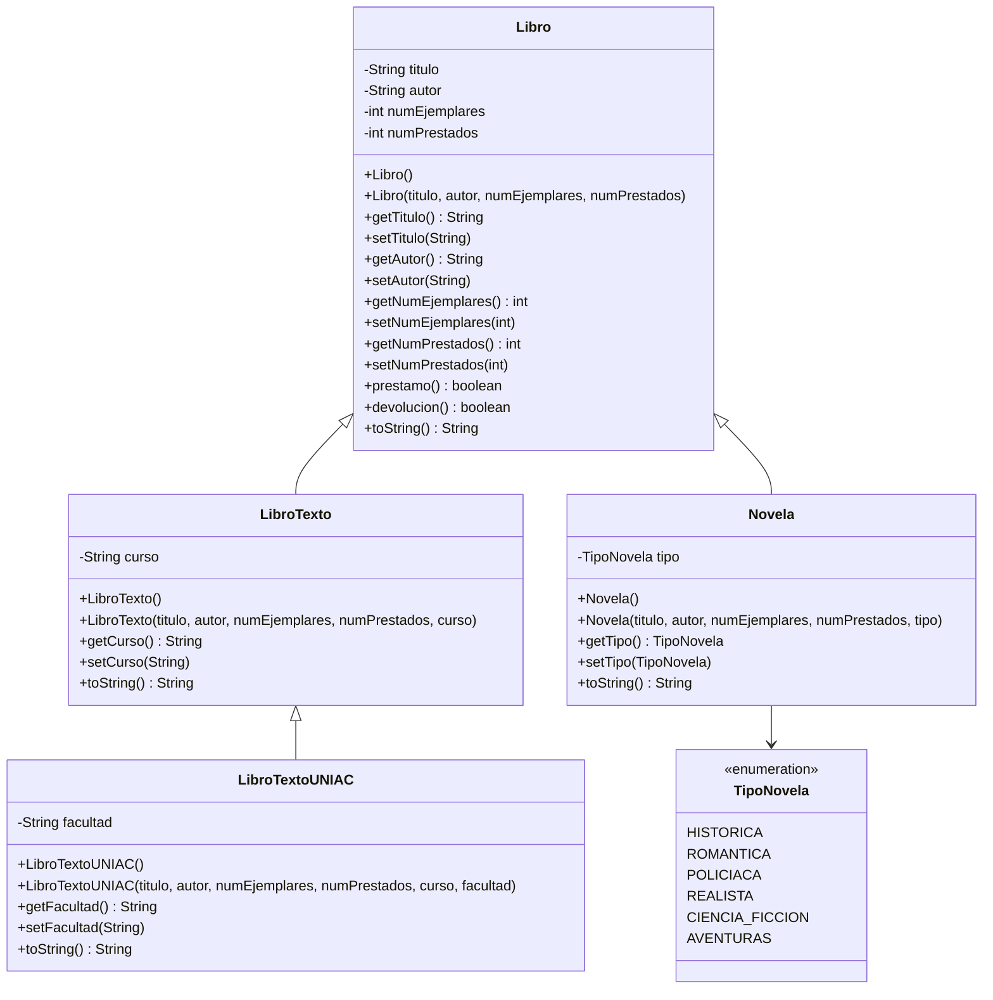

# Diagrama UML de clases

```mermaid
classDiagram
    class Libro {
        -String titulo
        -String autor
        -int numEjemplares
        -int numPrestados
        +Libro()
        +Libro(titulo, autor, numEjemplares, numPrestados)
        +getTitulo() String
        +setTitulo(String)
        +getAutor() String
        +setAutor(String)
        +getNumEjemplares() int
        +setNumEjemplares(int)
        +getNumPrestados() int
        +setNumPrestados(int)
        +prestamo() boolean
        +devolucion() boolean
        +toString() String
    }
    class LibroTexto {
        -String curso
        +LibroTexto()
        +LibroTexto(titulo, autor, numEjemplares, numPrestados, curso)
        +getCurso() String
        +setCurso(String)
        +toString() String
    }
    class LibroTextoUNIAC {
        -String facultad
        +LibroTextoUNIAC()
        +LibroTextoUNIAC(titulo, autor, numEjemplares, numPrestados, curso, facultad)
        +getFacultad() String
        +setFacultad(String)
        +toString() String
    }
    class Novela {
        -TipoNovela tipo
        +Novela()
        +Novela(titulo, autor, numEjemplares, numPrestados, tipo)
        +getTipo() TipoNovela
        +setTipo(TipoNovela)
        +toString() String
    }
    class TipoNovela {
        <<enumeration>>
        HISTORICA
        ROMANTICA
        POLICIACA
        REALISTA
        CIENCIA_FICCION
        AVENTURAS
    }
    Libro <|-- LibroTexto
    LibroTexto <|-- LibroTextoUNIAC
    Libro <|-- Novela
    Novela --> TipoNovela
```
